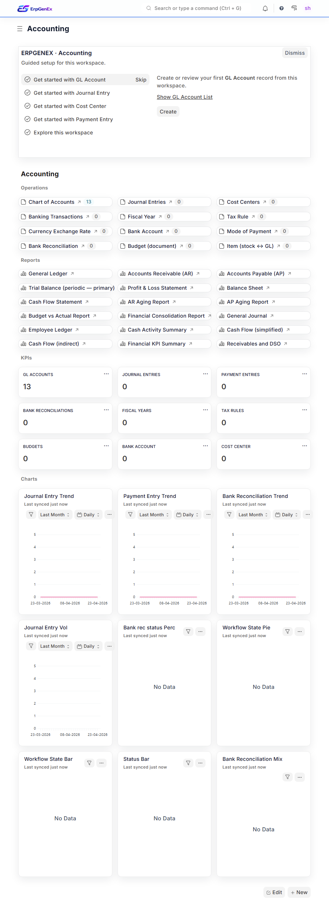
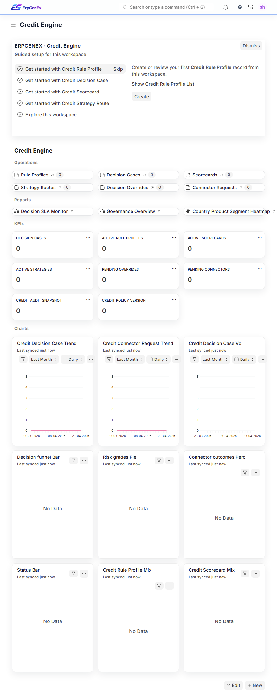
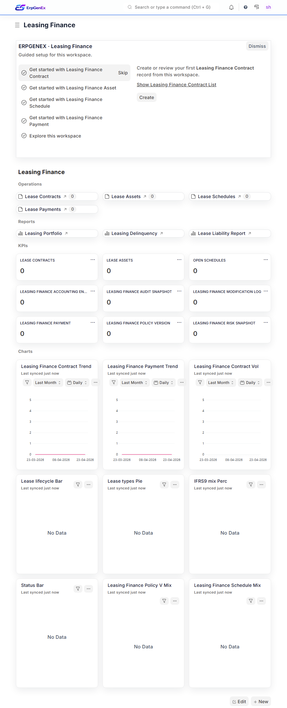
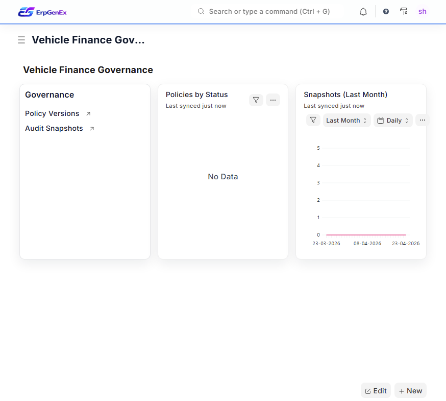

# ERPGENEX Core (`omnexa_core`)

[](https://opensource.org/licenses/MIT)
[](#)
[](#)

Core platform for ERPGENEX: workspace orchestration, app lifecycle management, licensing flow, integration extensibility, and enterprise desk experience on top of Frappe.

## Why ERPGENEX Core

- Unified control layer for modular ERP applications.
- Marketplace-driven install/update/uninstall workflow.
- Multi-app onboarding and workspace synchronization.
- Integration-ready architecture with hook-based extension points.
- Designed for production operations and SaaS deployment models.

## UI Preview

Add your UI screenshots under `screenshot/` with the names below and they will render automatically.






## تطبيقات جديدة على الـ bench (مع النواة أولاً)

1. في `sites/apps.txt`: ضع **`frappe`** ثم **`omnexa_core`** ثم باقي التطبيقات حسب تبعيات `required_apps`.  
2. من جذر الـ bench: `bench get-app https://github.com/ErpGenex/omnexa_core.git --branch develop` ثم `bench get-app https://github.com/ErpGenex/<APP>.git --branch develop`.  
3. أضف اسم المجلد إلى `sites/apps.txt` بالترتيب الصحيح، ثم `bench --site <site> install-app <APP>` و`migrate` و`bench build --app <APP>` عند الحاجة.  
4. في `hooks.py` للتطبيق الجديد: `required_apps = ["omnexa_core", ...]` عند الحاجة لتجنب أخطاء التثبيت.

## موقع جديد — أمر تسطيب (Bench)

افتراضياً، بعد `install-app omnexa_core` تُجلب التطبيقات الناقصة (إن وُجد `bench` على الـ PATH و`OMNEXA_AUTO_GET_APPS=1` وهو الافتراضي) وتُثبَّت حسب `sites/apps.txt` + الاكتشاف من GitHub عند التفعيل. للمستودعات الخاصة ضع توكناً:

```bash
export GITHUB_TOKEN="ghp_xxxxxxxx"   # أو GH_TOKEN
# اختياري: تثبيت الحد الأدنى فقط بدون باقي apps.txt
# export OMNEXA_AUTO_INSTALL_FULL_STACK_ON_CORE=0
```

من جذر الـ bench (بعد `bench setup requirements` ونسخ/تجهيز `sites/apps.txt` كما تريد للإنتاج):

```bash
cd /path/to/frappe-bench

bench new-site YOUR_SITE \
  --db-root-password ROOT_DB_PASSWORD \
  --admin-password ADMIN_PASSWORD

bench --site YOUR_SITE install-app omnexa_core
bench --site YOUR_SITE migrate
bench build
bench --site YOUR_SITE clear-cache
sudo supervisorctl restart all   # أو طريقة إعادة التشغيل المناسبة لبيئتك
```

إذا كان `omnexa_core` مثبتاً مسبقاً والموقع بلا باقي الحزمة:

```bash
bench --site YOUR_SITE execute omnexa_core.install.sync_stack
```

## Installation

### Option A: Docker (recommended for fast bootstrapping)

Use your existing Frappe/ERPNext Docker stack, then install `omnexa_core` into the running bench:

```bash
# inside your dockerized bench container
cd /home/frappe/frappe-bench
bench get-app https://github.com/ErpGenex/omnexa_core.git --branch develop
bench --site <your-site> install-app omnexa_core
bench --site <your-site> migrate
```

### Option B: Script / Bench CLI

For VM or bare-metal environments:

```bash
cd $PATH_TO_YOUR_BENCH
bench get-app https://github.com/ErpGenex/omnexa_core.git --branch develop
bench --site <your-site> install-app omnexa_core
bench --site <your-site> migrate
```

## Post-Install

- Open Desk and verify ERPGENEX workspaces are visible.
- Confirm app dependencies are fetched and installed.
- Run smoke checks for onboarding, marketplace, and reports.

## Contributing

This app uses `pre-commit` for formatting and linting.

```bash
cd apps/omnexa_core
pre-commit install
```

Enabled checks:

- `ruff`
- `eslint`
- `prettier`
- `pyupgrade`

## License

MIT
