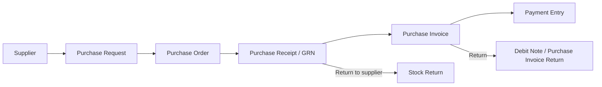
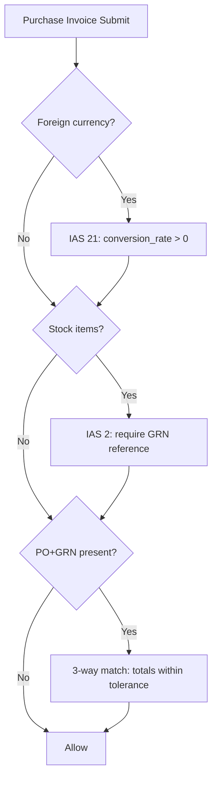

## Purchasing Module (Enterprise / IFRS) — Architecture

This repository already contains the core *Request-to-Pay* cycle in `omnexa_accounting`:

- **Supplier → Purchase Request → Purchase Order → Purchase Receipt (GRN) → Purchase Invoice → Payment Entry → Returns**

This document describes the production-ready enterprise posture added by `omnexa_core` **without breaking standard flows**.

### Objectives

- **IFRS / IAS alignment**
  - **IAS 2**: recognize inventory cost on receipt; prevent invoicing stock before GRN (3-way match).
  - **IAS 21**: enforce valid conversion rate for foreign-currency purchasing.
  - **IFRS 9**: due-date and payment schedule coherence (already enforced globally).
  - **IFRS 16 / IAS 37**: supported via global compliance guard patterns (leases/provisions can be extended).
- **Multi-branch / multi-company**
  - All purchasing doctypes require `company` + `branch`.
- **Scalable + safe**
  - Enforcement is behind **feature flags** and implemented as **submit-time controls** (low risk).

---

## Implemented Enhancements (Code)

### 1) Three-way match (PO + GRN + Invoice)

- **Where**: `omnexa_core/omnexa_core/procurement/three_way_match.py`
- **Enforced by**: `omnexa_core/omnexa_core/compliance_guard.py` on `Purchase Invoice` submit
- **Feature flag**: `global_purchase_three_way_match` (default: `true`)

Rules:

- If `Purchase Invoice.po_reference` is set: referenced **PO must be submitted** and supplier/company must match.
- If invoice contains **stock items**: `goods_receipt_reference` becomes **mandatory** (IAS 2 posture).
- If `goods_receipt_reference` is set: referenced **GRN must be submitted** and supplier/company must match.
- If both PO+GRN are present: invoice **cannot exceed GRN total** beyond tolerance (default 1%).

### 2) Supplier enterprise fields (non-destructive)

Seeded as **Custom Fields** by `omnexa_core/install.py`:

- `Supplier.supplier_name_ar`
- `Supplier.supplier_category` (Link to `Supplier Category`)
- `Supplier.is_vat_registered`
- `Supplier.trn`
- `Supplier.credit_limit`
- `Supplier.performance_rating`

### 3) PO line enterprise fields (non-destructive)

Seeded as **Custom Fields** by `omnexa_core/install.py`:

- `Purchase Order Item.schedule_date`
- `Purchase Order Item.warehouse`
- `Purchase Order Item.discount_percentage`
- `Purchase Order Item.tax_rule`

And calculation support was added in:

- `omnexa_accounting/doctype/purchase_order/purchase_order.py`  
  If `discount_percentage` exists, line `amount` and `grand_total` reflect the discount.

### 4) Supplier Category master

Added as a standard DocType in `omnexa_accounting`:

- `Supplier Category` (`Local / International / Contract / One-time`)

---

## Workflow (PR → PO → GRN → Invoice → Payment)

### Control points (enterprise)

---

## Integration & Extensibility

- **Accounting integration**: Purchase Invoice posting + Payment Entry allocation handled by accounting module. Compliance guard ensures governance.
- **Inventory integration**: GRN (Purchase Receipt) is the cutoff trigger for stock recognition (IAS 2 posture).
- **n8n integration**: use `omnexa_n8n_bridge` subscriptions to emit procurement events (`Purchase Order`, `Purchase Receipt`, `Purchase Invoice`, `Payment Entry`).

---

## Next Enterprise Add-ons (safe to add)

To complete a full enterprise procurement suite, the next iteration should add (all behind feature flags):

- Supplier contract pricing / volume discounts / validity windows
- Quotation comparison (multi-supplier matrix)
- Budget checks (optional) per department/branch
- Approval matrix templates (Manager → Finance → CEO)
- Procurement analytics reports + KPI cards (pending approvals, AP aging, delivery performance, price variance)

